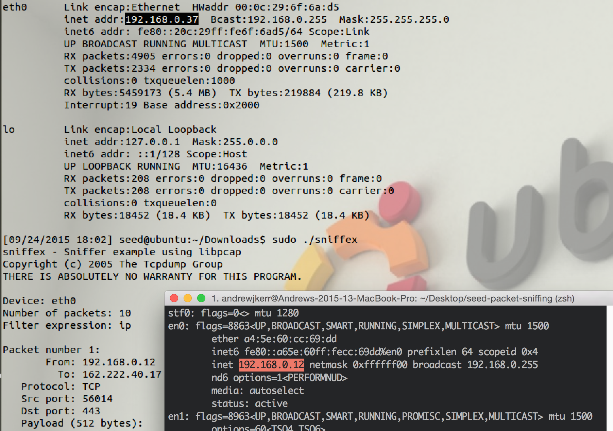
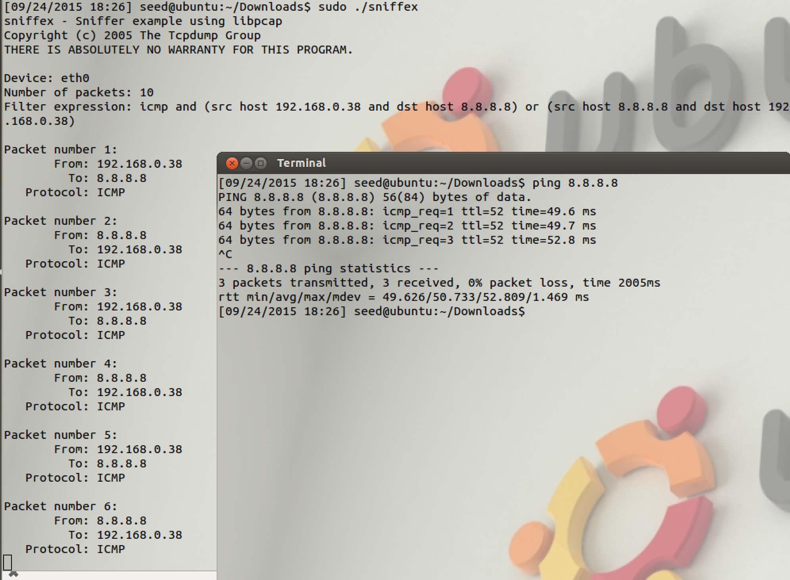
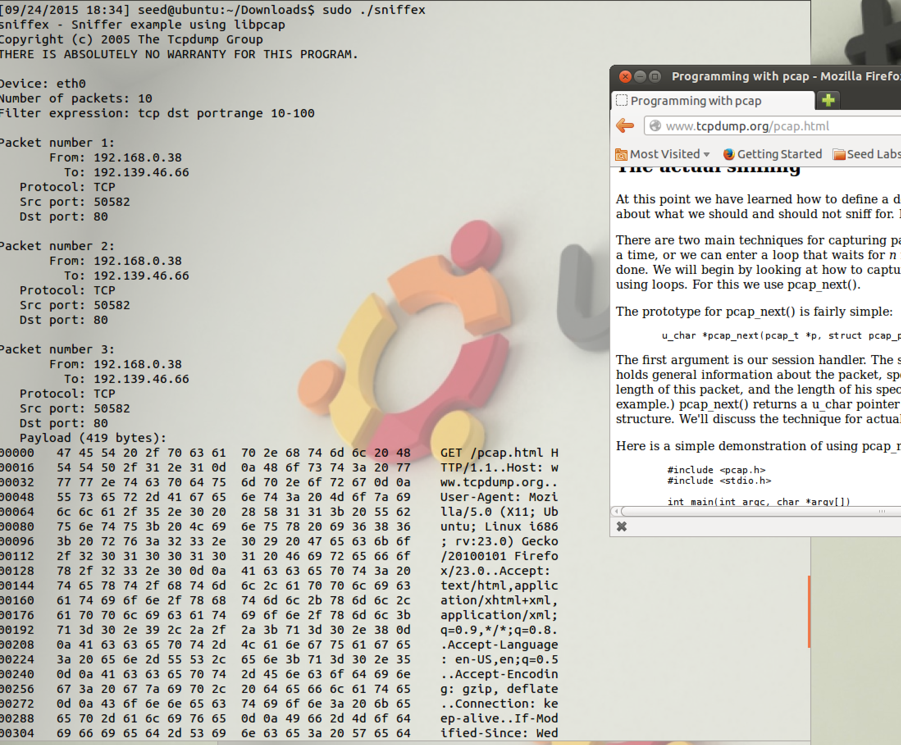

# Packet Sniffing and Spoofing Lab - Team 3

## Task 1 - Writing Packet Sniffing Program

### Part A - Understanding `sniffex`

```bash
gcc -Wall -o sniffex sniffex.c -lpcap
sudo ./sniffex
```


#### Problem 1

The following calls are within `sniffex.c`:

1. `pcap_lookupdev`: Finds a capture device to sniff on
2. `pcap_lookupnet`: Returns the network number and mask for the capture device
3. `pcap_open_live`: Starts sniffing on the capture device
4. `pcap_datalink`: Returns the kind of device we're capturing on
5. `pcap_compile`: Compiles the filter expression stored in a regular stringin order to set the filter
6. `pcap_setfilter`: Sets the compiled filter
7. At this point, we can either sniff one packet at a time (`pcap_next`) or continuously sniff (`pcap_loop`). Since `sniffex.c` uses we'll continue with `pcap_loop`: Sets callback function for new (filtered!) packets
8. `pcap_freecode`: Frees up allocated memory generated by `pcap_compile`
9. `pcap_close`: Closes the sniffing session

#### Problem 2

You need root in order for `sniffex` to run because `sniffex` will need to access a network device which a non-root user cannot do.


The code that causes this to fail is:

```c
/* find a capture device if not specified on command-line */
dev = pcap_lookupdev(errbuf);
if (dev == NULL) {
    fprintf(stderr, "Couldn't find default device: %s\n",
        errbuf);
    exit(EXIT_FAILURE);
}
```

#### Problem 3

Promiscuous mode allows for a network sniffer to pass _all_ traffic from a network controller and not just the traffic that the network controller was intended to receive. Whether or not the capture device is in promiscuous mode determines on the third parameter (a 'boolean' int) in `pcap_open_live` on line 551. The code below highlights the difference:

```c
/* promisc mode on */
handle = pcap_open_live(dev, SNAP_LEN, 1, 1000, errbuf);

/* promisc mode off */
handle = pcap_open_live(dev, SNAP_LEN, 0, 1000, errbuf);
```

By default, `sniffex` sniffs in promiscuous mode. In order to see the difference in IP addresses, I switched the VM's network adapter to 'Bridged' and then ran `sniffex`. At first, I got a popup from VMWare Fusion asking if it was ok for a virtual machine to monitor all traffic (I allowed it).


After allowing it, `sniffex` picks up a lot of packets from my host machine! An example is shown below.



Turning off promiscuous mode is as easy as fliping a `1` to a `0` in `pcap_open_live`. I ran `ping 8.8.8.8` to create some network traffic and the capture is seen below.


### Task B - Writing Filters

A _super_ helpful resource here was the man page for pcap-filter which can be found at http://www.tcpdump.org/manpages/pcap-filter.7.html.

#### Part A - ICMP between two hosts

Using `ping 8.8.8.8` again, we can filter only the ICMP packets by modifying the `filter_exp[]` string.

```c
// ICMP packets between this host and 8.8.8.8
char filter_exp[] = "icmp and (src host 192.168.0.38 and dst host 8.8.8.8) or (src host 8.8.8.8 and dst host 192.168.0.38)";
```

Running both `sniffex` and `ping 8.8.8.8` results in the following output:



#### Part B - TCP packets with destination port from 10 - 100

Changing the `filter_exp[]` variable again we can sniff only TCP packets with a destination port from 10 to 100.

```c
// TCP packets with dest port 10-100
char filter_exp[] = "tcp dst portrange 10-100";
```

Navigating to a webpage within Firefox (over HTTP, HTTPS isn't port 80!) gives the following:



#### Part C - Sniffing Passwords

Since we're sniffing `telnet` passwords, we can just look for tcp packets on port 23.

```c
char filter_exp[] = "tcp port 23";
```

Using my host machine, I telnet into the SEED VM.


```bash
[09/24/2015 18:41] seed@ubuntu:~/Downloads$ sudo ./sniffex
sniffex - Sniffer example using libpcap
Copyright (c) 2005 The Tcpdump Group
THERE IS ABSOLUTELY NO WARRANTY FOR THIS PROGRAM.

Device: eth0
Number of packets: 10
Filter expression: tcp port 23

Packet number 1:
       From: 192.168.0.12
         To: 192.168.0.38
   Protocol: TCP
   Src port: 58572
   Dst port: 23
   Payload (1 bytes):
00000   64                                                  d

Packet number 2:
       From: 192.168.0.38
         To: 192.168.0.12
   Protocol: TCP
   Src port: 23
   Dst port: 58572

Packet number 3:
       From: 192.168.0.12
         To: 192.168.0.38
   Protocol: TCP
   Src port: 58572
   Dst port: 23
   Payload (1 bytes):
00000   65                                                  e

Packet number 4:
       From: 192.168.0.38
         To: 192.168.0.12
   Protocol: TCP
   Src port: 23
   Dst port: 58572

Packet number 5:
       From: 192.168.0.12
         To: 192.168.0.38
   Protocol: TCP
   Src port: 58572
   Dst port: 23
   Payload (1 bytes):
00000   65                                                  e

Packet number 6:
       From: 192.168.0.38
         To: 192.168.0.12
   Protocol: TCP
   Src port: 23
   Dst port: 58572

Packet number 7:
       From: 192.168.0.12
         To: 192.168.0.38
   Protocol: TCP
   Src port: 58572
   Dst port: 23
   Payload (1 bytes):
00000   73                                                  s

Packet number 8:
       From: 192.168.0.38
         To: 192.168.0.12
   Protocol: TCP
   Src port: 23
   Dst port: 58572

Packet number 9:
       From: 192.168.0.12
         To: 192.168.0.38
   Protocol: TCP
   Src port: 58572
   Dst port: 23
   Payload (2 bytes):
00000   0d 00                                               ..

Packet number 10:
       From: 192.168.0.38
         To: 192.168.0.12
   Protocol: TCP
   Src port: 23
   Dst port: 58572

Capture complete.

```

Obviously `sniffex` would need some modification in order for us to clearly sniff the passwords, but, for short passwords like the password to the SEED VM, we don't need to output just the payload!
