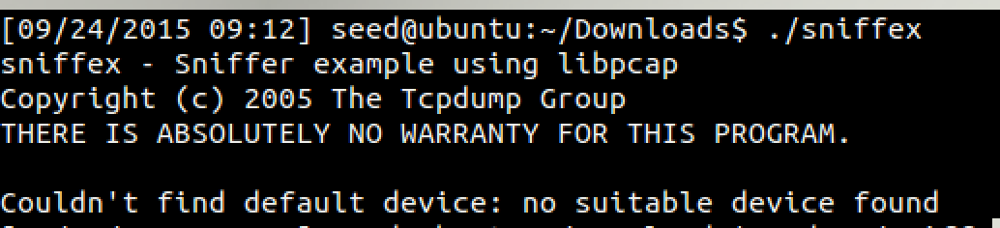

# Packet Sniffing and Spoofing Lab
## Team 3

## Problem 1

The following calls are within `sniffex.c`:

1. `pcap_lookupdev`: Finds a capture device to sniff on
2. `pcap_lookupnet`: Returns the network number and mask for the capture device
3. `pcap_open_live`: Starts sniffing on the capture device
4. `pcap_datalink`: Returns the kind of device we're capturing on
5. `pcap_compile`: Compiles the filter expression stored in a regular stringin order to set the filter
6. `pcap_setfilter`: Sets the compiled filter
7. At this point, we can either sniff one packet at a time (`pcap_next`) or continuously sniff (`pcap_loop`). Since `sniffex.c` uses we'll continue with `pcap_loop`: Sets callback function for new (filtered!) packets
8. `pcap_freecode`: Frees up allocated memory generated by `pcap_compile`
9. `pcap_close`: Closes the sniffing session

## Problem 2

You need root in order for `sniffex` to run because `sniffex` will need to access a network device which a non-root user cannot do.



The code that causes this to fail is:

```c
/* find a capture device if not specified on command-line */
dev = pcap_lookupdev(errbuf);
if (dev == NULL) {
    fprintf(stderr, "Couldn't find default device: %s\n",
        errbuf);
    exit(EXIT_FAILURE);
}
```
